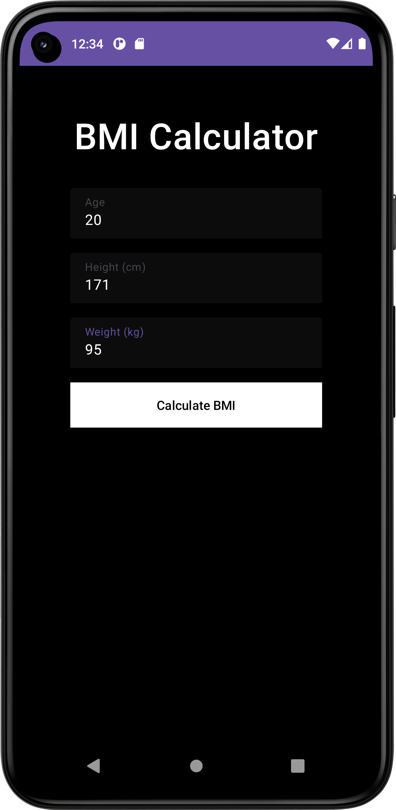
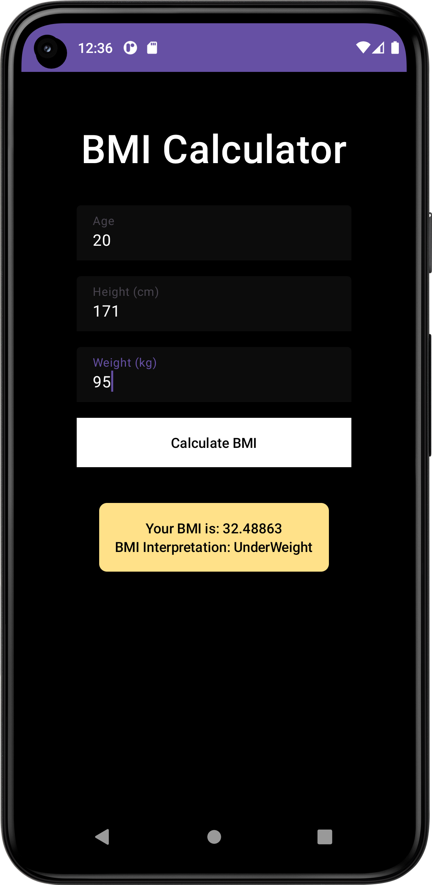

<h2>BMI(Body Mass Calculator)</h2>
<h3>
  This Android app is designed to calculate Body Mass Index (BMI) and provide users with insights into their health based on their height and weight. Built with Kotlin and Jetpack Compose, it offers a modern and intuitive user interface for a seamless experience.
</h3>
<H2>Screenshot</H2></H2>
<h2>Input Screen</h2>

<h2>Result Screen</h2>

